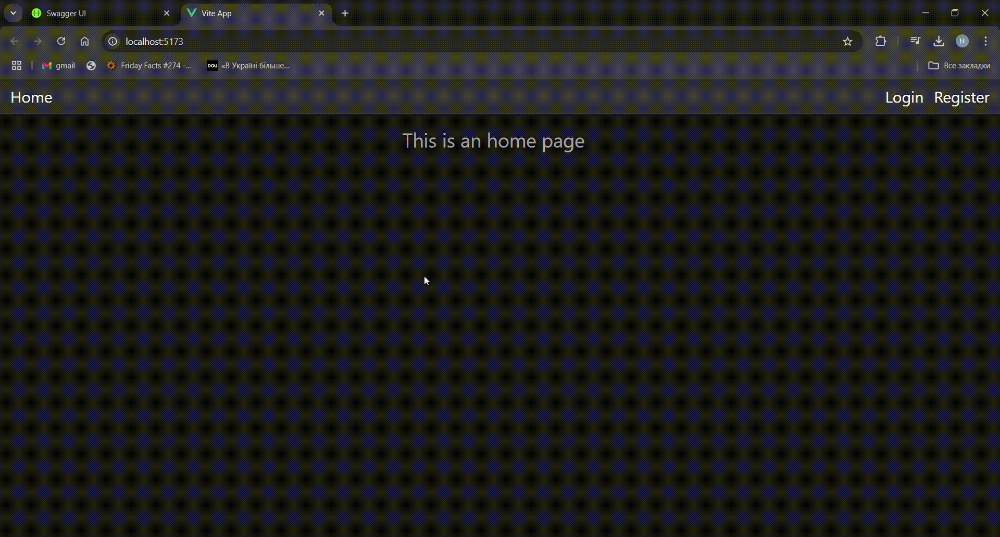
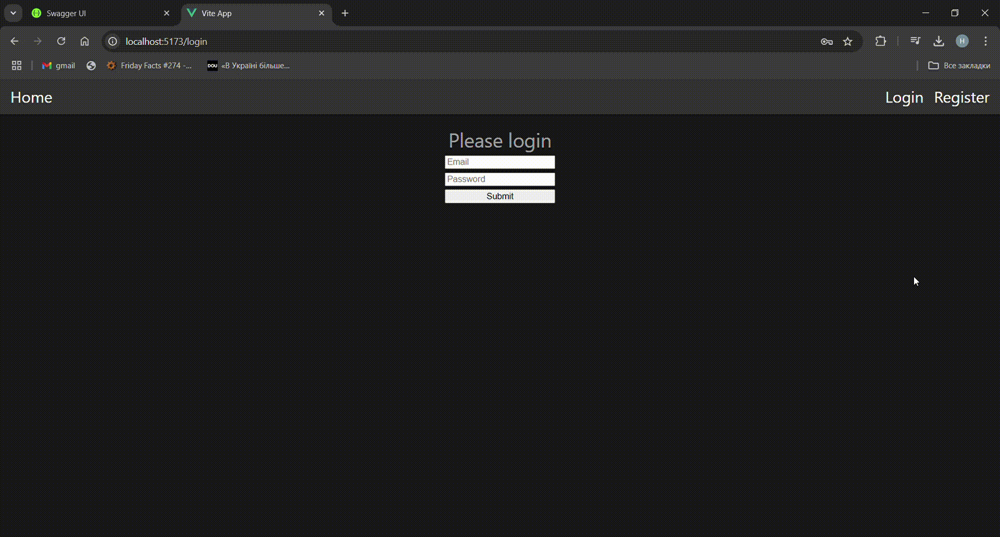
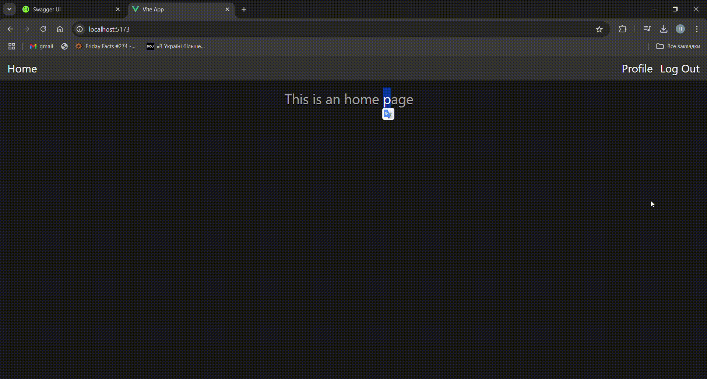

# learning-app

Цей проєкт є інтерфейсною реалізацією застосунку для відстежування власного прогресу. Проєкт використовує наступні технології:
- Vue 3
- Pinia(global store)

## Розгортання проєкту

#### За допомогою IDE(Visual Studio Code):
```sh
npm install
```

#### Compile and Hot-Reload for Development

```sh
npm run dev
```

#### Compile and Minify for Production

```sh
npm run build
```

### За допомогою Docker:
Цей проєкт містить Dockerfile з налаштуваннями проєкту для запуску в образі Docker. Для початку треба зробити build проєкту:
```sh 
docker build -t learning-app .
```
Далі запустити сам образ:
```sh
docker run -it -p 8080:8080 --rm --name dockerize-vuejs-app-1 learning-app
```

Демо проєкту:

1. Реєстрація користувача:


2. Авторизація користувача(з збереженням токену у local storage)


3. Профіль звичайного користувача


4. CRUD для адміністратора для редагування, видалення, просмотру користувачів
